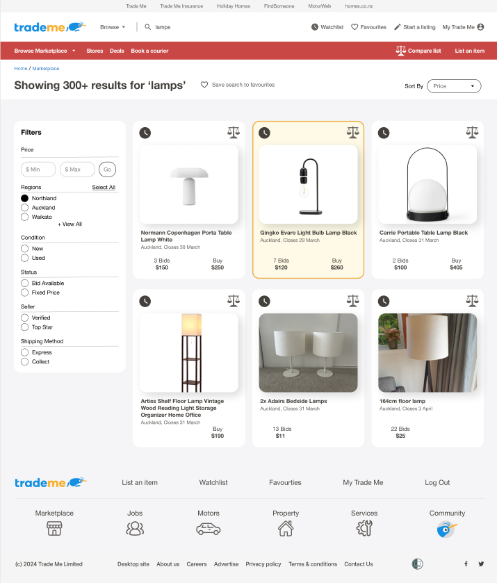

# Mission Ready Level 5 Mission 5 Trade Me Project 🚀

Final project from the Mission Ready Level 5 course: A collaborative effort with UX designers to enhance the design of the Trade Me website. 

This application was created based on a version of prototype design received from UX Designers. Each developer worked on one screen of the application with both frontend and backend functionality. 

Technologies used include:
- Frontend: React, HTML, CSS, JavaScript
- Backend: Express.js
- Database: MongoDB
- Docking: Docker Compose

# Search Results Page Overview 💡

This application features two key pages from the Trade Me prototype design: the Search Results and Bidding Modals. My focus was primarily on the Search Results page, encompassing both frontend and backend development.

The Search Results page is structured into several components: Header, Filter, Products, and Footer. The Products component interacts with the MongoDB backend, where  data like name, date, and images are stored. This data is retrieved via a POST request from the backend to the frontend, and the containers are dynamically displayed using the map method.

